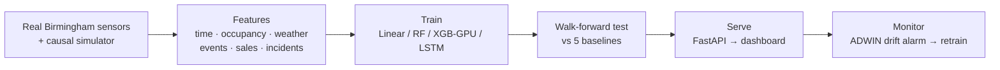
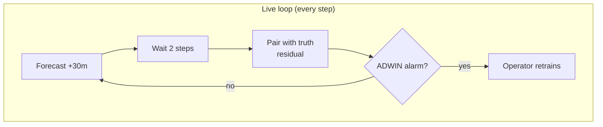
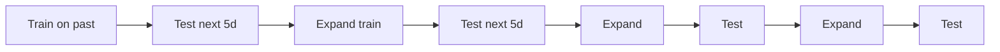
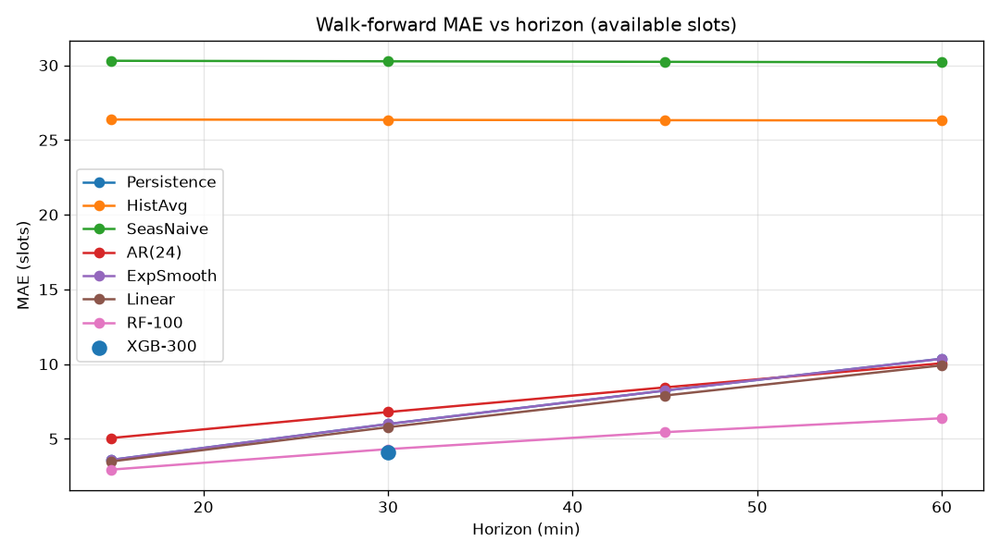
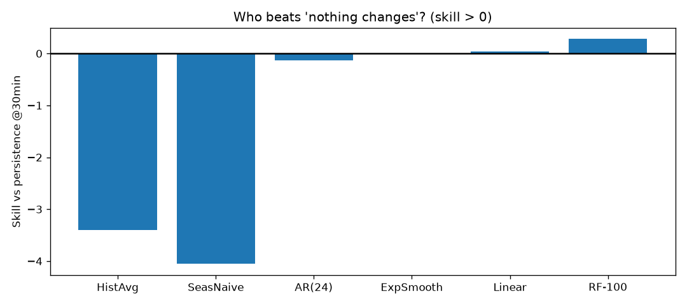
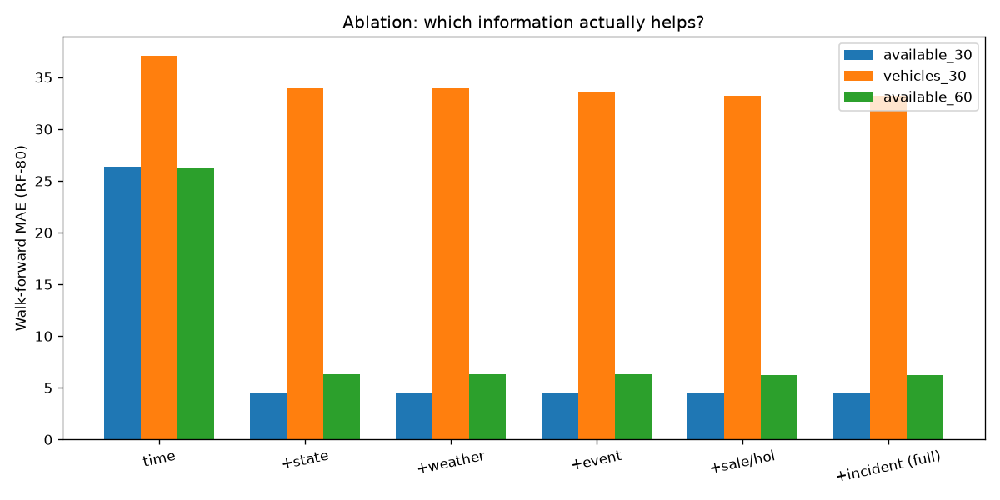
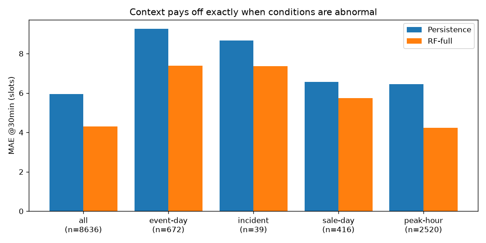
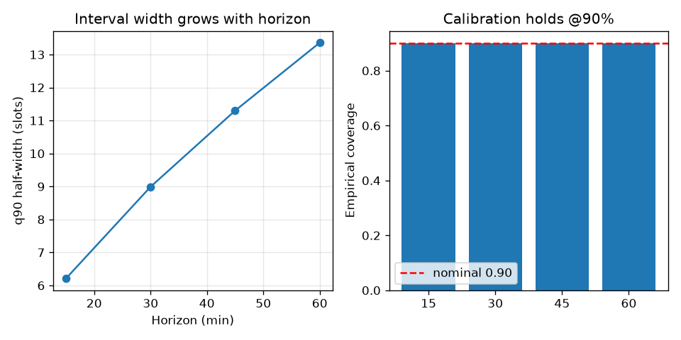
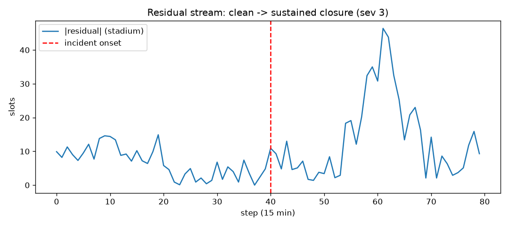
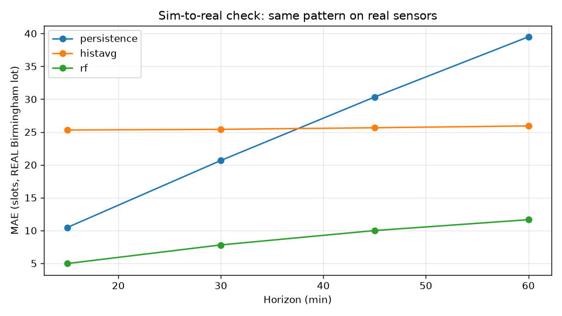

# Real-Time Traffic & Parking Predictor
### A context-aware, uncertainty-aware, drift-monitored forecasting system — validated on simulated + real sensor data
*Present from this file. All charts embedded · all numbers inline (traceable to `models/*.json`) · diagrams render as mermaid on GitHub.*

---

## 1 · Problem: current-status dashboards can't see what's coming
At 5 PM a lot shows 30 free spaces — but a 6 PM concert empties it by 7. We forecast **traffic congestion and parking availability 15/30/45/60 min ahead**, conditioned on time, location, weather, holidays, sales, events and incidents — then explain, recommend, and monitor.

> Say: "We don't just predict parking — we prove the predictions are honest, explain them, and watch the model stay valid live."

---

## 2 · System pipeline

> Say: "Data flows one way, time always moves forward, and every claim is measured on unseen data."

---

## 3 · Data: simulated for control, real for credibility
| Feed | What | Size |
|---|---|---|
| Historical (simulated, causal) | 90 days × 15-min × 5 zones, events/sales/weather + 41 incidents | 43,180 rows |
| Live (simulated sensors) | Stateful stepper, identical physics (train↔serve parity) | 5 zones |
| Real (UCI Birmingham NCP, UK OGL) | Market lot, cap 577, Oct–Dec 2016, resampled to 15-min | ~2,900 rows |
Parking follows proportional-turnover dynamics (avg stay ~1.5 h): occupancy spans 25–100% per zone instead of pegging at full.

---

## 4 · Evaluation protocol: the methodology upgrade
4 expanding walk-forward origins × 5-day test blocks · strictly past→future · train-only imputation · purge of train rows whose 60-min label overlaps the test block · MAE/RMSE per horizon + **skill vs persistence**.

> Say: "Static splits can reverse model rankings — that's published 2026 finding, so we never use them."

---

## 5 · Headline result: the dumb baseline nearly wins

| Model, available_30 | MAE | Skill |
|---|---|---|
| Persistence ("no change") | 5.99 | 0.00 |
| SES / Linear / AR(24) | 5.99 / 5.78 / 6.79 | 0.00 / +0.04 / −0.13 |
| **Random Forest-100** | **4.31** | **+0.28** |
| **XGBoost-300 (CUDA)** | **4.07** | **+0.32** |
| HistAvg / Seasonal-naive | 26.3 / 30.3 | far below |
| Vehicles_30: persistence 57.2 → **RF 32.9 (+0.42)** | | |

> Say: "Parking has inertia, so 'no change' is brutally strong — we proved we beat it instead of just quoting accuracy. Traffic, with mood swings, is where ML wins big."

---

## 6 · Who beats "nothing changes"?

Only context-aware ML clears zero. Weekly-seasonal logic fails — real (and realistic simulated) weeks aren't self-similar. An honest negative result, kept in the report.

---

## 7 · Ablation: which information helps?

`available_30` MAE: time-only **26.35** → +state **4.42** → +weather 4.44 → +event 4.45 → +sale/hol 4.42 → +incident 4.43. Current state does ~everything **globally** — because events are rare and averages hide them. So we asked *when* context helps (next slide).

---

## 8 · Context pays exactly when conditions are abnormal

| Slice | RF | Persistence | Skill |
|---|---|---|---|
| all (n=8636) | 4.31 | 5.95 | +0.28 |
| peak-hour (2520) | 4.23 | 6.46 | **+0.35** |
| event-day (672) | 7.40 | 9.26 | +0.20 (−1.87 slots) |
| incident (39) | 7.35 | 8.67 | +0.15 (small-n, stated) |
| sale-day (416) | 5.75 | 6.57 | +0.12 |

---

## 9 · Honest uncertainty, not decoration

Bands = 90th percentile of 9,600 walk-forward residuals per horizon: **6.2 / 9.0 / 11.3 / 13.4 slots** — verified **0.900** coverage. The dashboard prints method + coverage beside the bands.

---

## 10 · The model watches itself go stale

Sustained closure doubles mistakes (**6.7 → 13.8**); ADWIN alarms **23 steps** after onset with **0 clean false alarms** (delta 0.002 + 20-pairing warmup). Demo: burn in → Inject incident → banner.

---

## 11 · Validated on real sensors, not just simulation

Walk-forward on the Birmingham lot: persistence 20.67 → HistAvg 25.41 → **RF 7.81 (skill +0.62)**. Real sensors are ~3× noisier than sim — and the ML edge is ~2× bigger. Same pattern, stronger.

> Say: "Simulated for controlled experiments, validated against a real zone — that answers 'but your data is fake'."

---

## 12 · Dashboard tour (live after these slides)
Command strip (sector · time-travel · auto-sync · inject) → severity-ordered alert lane → 3 hero pillars (horizon-switchable forecast) → live charts + step table → RF-importance bars → ranked routing → saturation grid → Birmingham replay card → provenance footer. Profile button carries model/coverage/skill facts.

---

## 13 · Failures we kept (viva gold)
- Textbook smoother **blew up** (MAE 192) on clipped occupancy → diagnosed, replaced.
- LSTM scored **worse than average twice** → fixed via target normalization + per-location splits (final: MAE 7.9, R² 0.994).
- First simulator pegged **every lot at 99% full** → rebalanced with realistic turnover.
- Drift alarms **never fired** (renamed River API + pairing bug) → found, fixed, calibrated.
> Say: "Each failure is logged with evidence — ask us about any of them."

---

## 14 · Limits & next steps (specific, not vague)
Daytime-only 2016 real data · single real lot · zones learn independently (scoped next step: 1-block STGCN over zone adjacency) · in-fold conformal calibration → nested · demo CORS + no auth flagged as deployment work.

## 15 · Artifact map
`docs/REPORT.md` · `docs/EXPERIMENTS.md` (E01–E07 + failures) · `docs/DECISIONS.md` (D01–D16) · `docs/figures/` (these 7 charts) · `docs/DEMO_AND_VIVA.md` (demo script + Q&A) · `models/*.json` (exact numbers) · `tests/` (18 green) · `RESEARCH_UPGRADES.md` · `PROJECT_PS.md`. Big `*.pkl`/CSV git-ignored by design; trained weights ship as split zips.
